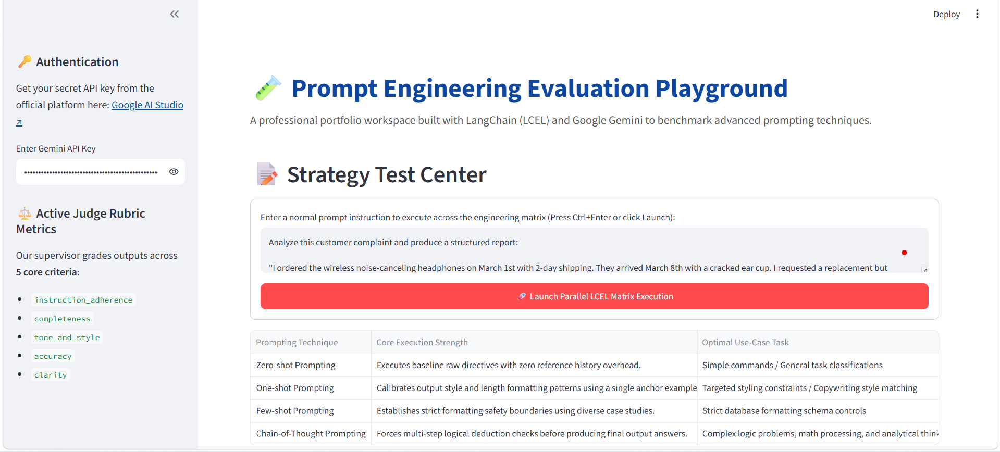
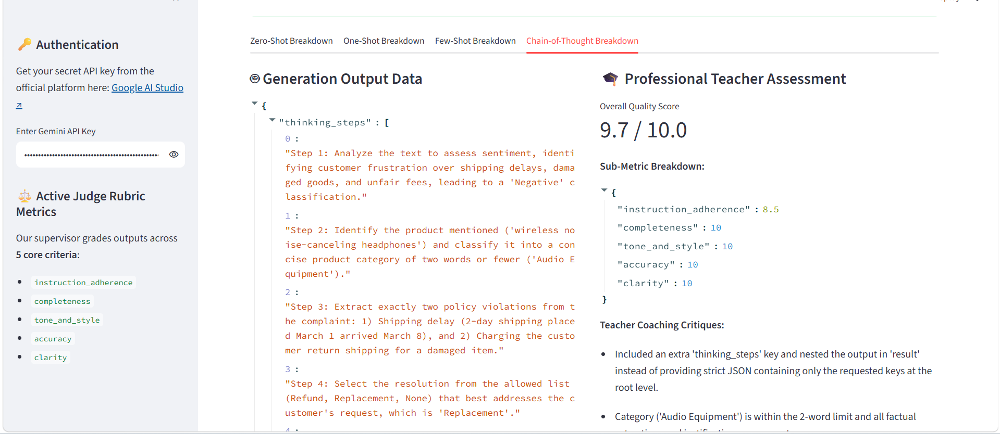

# 🧪 Prompt Engineering Evaluation Playground

A Streamlit web app that benchmarks four core prompting techniques using Google Gemini and LangChain. An independent LLM judge scores each technique across five criteria so you can see which approach works best for any task.

---

## Overview

This project runs the same user prompt through four different prompting strategies in parallel:

- **Zero-shot** — no examples, just the instruction
- **One-shot** — one example shown to guide the model
- **Few-shot** — three examples to establish a pattern
- **Chain-of-Thought** — forces step-by-step reasoning before answering

An LLM judge then grades all four outputs at once on a 0–10 scale across instruction adherence, completeness, tone, accuracy, and clarity.

---

## Objectives

- Compare how different prompting techniques affect output quality
- Demonstrate parallel execution with LangChain LCEL (`RunnableParallel`)
- Build a reusable evaluation pipeline with a single judge call
- Create a portfolio-ready app with clean architecture

---

## Tech Stack

| Layer     | Tool                             |
| --------- | -------------------------------- |
| Frontend  | Streamlit                        |
| LLM       | Google Gemini (gemini-3.6-flash) |
| Framework | LangChain (LCEL)                 |
| Language  | Python 3.11+                     |
| Parser    | Custom safe JSON parser          |

---

## Installation

1. Clone the repo

```bash
git clone https://github.com/yourusername/Prompt_PlayGround.git
cd Prompt_PlayGround
```

2. Create a virtual environment

```bash
python -m venv .venv
```

3. Activate it

```bash
# Windows
.venv\Scripts\activate

# macOS / Linux
source .venv/bin/activate
```

4. Install dependencies

```bash
pip install -r requirements.txt
```

---

## How to Run

1. Get a free API key from [Google AI Studio](https://aistudio.google.com)
2. Run the app

```bash
streamlit run app.py
```

3. Open your browser at `http://localhost:8501`
4. Paste your API key in the sidebar
5. Type a prompt and click **Launch Evaluation**

---

## Project Structure

```
Prompt_PlayGround/
├── app.py
├── requirements.txt
├── .gitignore
├── chains/
│   ├── __init__.py
│   ├── judge_chain.py
│   ├── prompt_chain.py
│   └── safe_parser.py
├── templates/
│   ├── __init__.py
│   ├── judge.py
│   └── prompt_library.py
│   ├── judge.py
│
│__ README.md
│
└── images/
    ├── Prompt_Playground.png
    ├── Prompt_Playground_Evaluation.png
    └── Prompt_Playground_Evaluation2.png
```

---

## Screenshots

### Main Interface



### Evaluation Results


### Detailed Breakdown



---

## Notes

- **Free tier limit:** ~4 evaluations per day (5 API calls per run: 4 workers + 1 judge)
- All outputs are parsed safely — malformed JSON is caught and displayed as raw text instead of crashing the app
